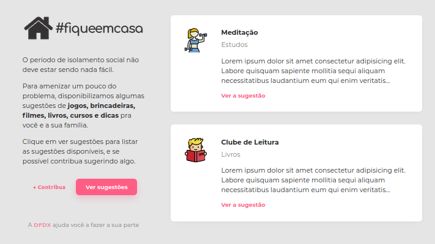
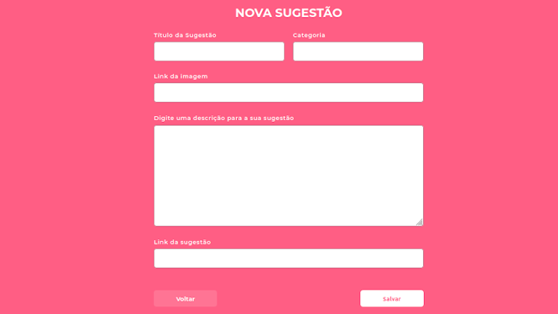
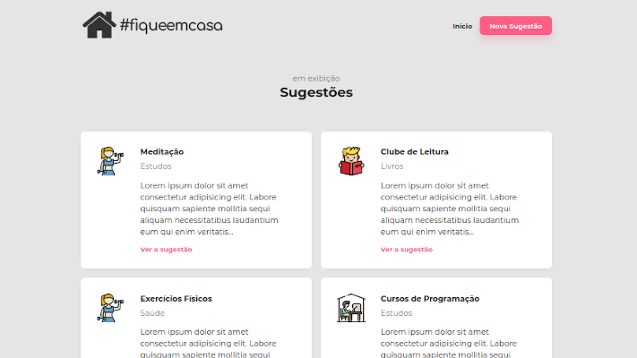

# fiqueemcasa

> Projetinho rápido, feito para relembrar conceitos de html, css, js, layout, NodeJS, etc. 

Adaptação feita sobre o que foi apresentado por Mayk Brito (@maykbrito) da @RocketSeat, durante o WorkshopDev (https://www.youtube.com/watch?v=cprMYC8PCVY) que foi ao ar em março/2020, durante o período de isolamento social devido a Covid-19.

## Tecnologias 

O projeto foi desenvolvido com as seguintes tecnologias:

- [Node.js](https://nodejs.org/en/)
- [Express](https://expressjs.com/)
- [nodemon](https://www.npmjs.com/package/nodemon)
- [Nunjucks](https://www.npmjs.com/package/nodemon)
- [SQLite](https://www.sqlite.org/)

Os ícones usados foram disponibilizados pela [Flaticon](https://www.flaticon.com).

## Screenshots

